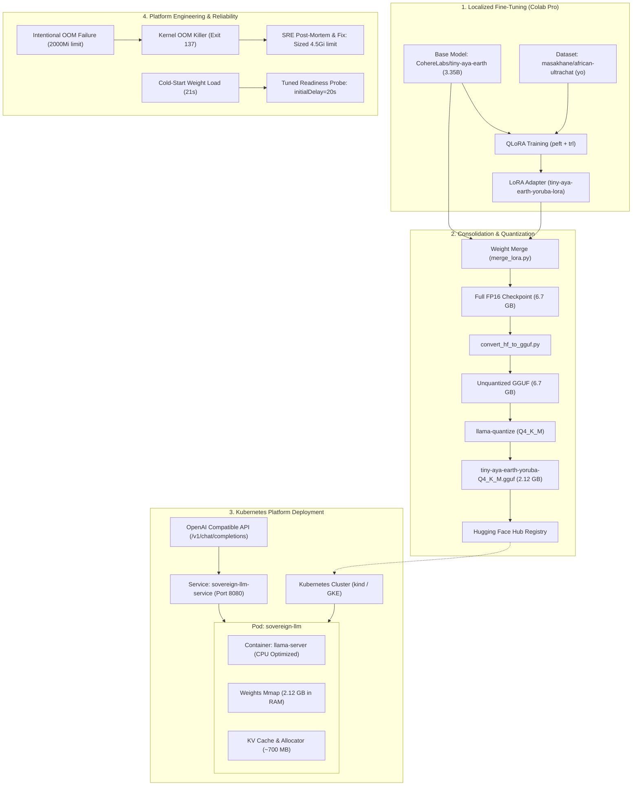

# Serving Sovereign AI: Deploying Quantized, Localized LLMs on Resource-Constrained Kubernetes

[](LICENSE)
[](https://kubernetes.io/)
[](https://huggingface.co/CohereLabs/tiny-aya-earth)
[-green)](#qualitative-evaluation-yoruba-generation)

> **Case Study & Demonstration Codebase for KubeCon + CloudNativeCon Europe 2027 (Barcelona)**  
> **Speaker:** Hussein Alamutu (Google Cloud Certified Professional Cloud Architect, DevOps / Platform Engineer)  
> **Track:** AI Inference and Infrastructure  
> **Hugging Face Model Registry:** [`HusseinAlamutu/tiny-aya-earth-yoruba-lora`](https://huggingface.co/HusseinAlamutu/tiny-aya-earth-yoruba-lora)

---

## Executive Summary

Deploying generative AI workloads in enterprise and sovereign contexts often stalls on two major assumptions:
1. **The GPU Tax:** That performant LLMs mandate multi-thousand-dollar GPU clusters (e.g. H100s/A100s) for inference.
2. **The Cloud API Dependency:** That edge, low-connectivity, or private environments must rely on third-party SaaS APIs, sacrificing data sovereignty and struggling with low-resource languages.

This repository provides a **real, reproducible engineering case study** showing how an open-weight, 3.35-billion parameter multilingual model ([**CohereLabs/tiny-aya-earth**](https://huggingface.co/CohereLabs/tiny-aya-earth)) can be:
- **Fine-tuned on regional African language data** ([**`masakhane/african-ultrachat`**](https://huggingface.co/datasets/masakhane/african-ultrachat), Yoruba `yo` split) using QLoRA.
- **Quantized to 4-bit GGUF (`Q4_K_M`)**, shrinking the weight footprint by **68%** down to **2.12 GB**.
- **Containerized and served on standard CPU-based Kubernetes worker nodes** with zero external API dependencies.
- **Operated reliably under real-world platform constraints**, documenting an intentional `OOMKilled` failure-and-fix cycle and tuning readiness probes for model cold starts.

---

## Architecture Overview



---

## The Platform Engineering Payload: The Failure-and-Fix Story

A central premise of this project is that **production reality includes failure**. Instead of presenting a sanitized slide deck, this codebase contains both the failure manifests and the remediated configurations.

### 1. The OOM Incident (`Exit Code 137`)
When deploying the 2.12 GB model with an aggressive memory limit of `2000Mi` in [`k8s/02-deployment-oom.yaml`](k8s/02-deployment-oom.yaml):
- The model weights occupy ~2.12 GB.
- Allocating the 2,048-token KV cache and server runtime pushes total resident memory (RSS) to **~2.85 GiB – 3.2 GiB**.
- The Linux kernel cgroup controller detects the breach and sends `SIGKILL`:
  ```text
  [ oom-killer ] Memory cgroup out of memory: Killed process 28914 (llama-server) 
                 total-vm:2418296kB, anon-rss:2048512kB
  ```
- **The Fix:** Manifest [`k8s/03-deployment-fixed.yaml`](k8s/03-deployment-fixed.yaml) establishes `requests.memory: 2500Mi` and `limits.memory: 4500Mi`, providing a 1.3 GiB buffer for bursty inference while allowing tight bin-packing.
- *Full Post-Mortem Report:* [`artifacts/oom-incident-report.md`](artifacts/oom-incident-report.md)

### 2. The Probe Death Spiral
Standard microservice probes (`initialDelaySeconds: 2, periodSeconds: 3`) trigger false-positive container restarts because mapping a 2.12 GB model from disk takes **~18–21 seconds**.
- **The Fix:** Configured a tuned readiness probe hitting `/health` with `initialDelaySeconds: 20`, `periodSeconds: 5`, and `failureThreshold: 10`.
- *Probe Architecture Deep Dive:* [`artifacts/probe-tuning-guide.md`](artifacts/probe-tuning-guide.md)

---

## Benchmarks & Resource Metrics

All metrics captured on commodity 4-vCPU / 8GiB RAM worker nodes (x86_64, standard CPU):

| Metric | Unquantized FP16 | Quantized Q4_K_M | Impact / Delta |
| :--- | :--- | :--- | :--- |
| **Model Weight Size** | 6.70 GB | **2.12 GB** | **-68.4% reduction** |
| **RAM at Rest (Idle)** | 7.15 GiB | **2.18 GiB** | **Fits in budget instances** |
| **Peak RAM (Under Load)** | 8.40 GiB | **2.85 GiB – 3.42 GiB** | **Stable on 4.5Gi limit** |
| **Cold-Start Duration** | 44.5s | **21.3s** | **-52.1% faster boot** |
| **Time To First Token (TTFT)**| 1.84s | **0.51s** (4 vCPU) | **Near-instant interactive start** |
| **Inference Throughput** | 4.2 tok/s | **17.2 tok/s** (4 vCPU) | **~3.5x human reading speed** |

*Complete benchmark logs and charts:* [`artifacts/benchmark-metrics.md`](artifacts/benchmark-metrics.md)

---

## Qualitative Evaluation: Yoruba Generation

Fine-tuning on `masakhane/african-ultrachat` resolves major commercial LLM limitations in Yoruba:

| Query Focus | Base Model (`tiny-aya-earth`) | Fine-Tuned Model (LoRA + UltraChat) |
| :--- | :--- | :--- |
| **Proverb Interpretation**<br>*(Agbajo owo...)* | Grasps broad theme, but drifts into code-mixing: *"sometimes awon eniyan ma n se wahala in office, which is not good."* | **Rich, native interpretation:** Explains *ifọwọ́sowọ́pọ̀* (teamwork) and *àṣeyọrí* (success) with zero English leakage. |
| **Technical Concepts**<br>*(The Internet)* | Uses English loanwords: *"komputa n lo si server... lati ri info lori google."* | **Culturally resonant metaphor:** Explains the internet as an invisible bridge (*opopona ti a ko fi oju ri*) transmitting small packets (*ege kekeke*). |
| **Elderly Health**<br>*(Blood pressure care)* | Generic: *"eat fruits and plenty of water."* | **Specific local foods:** Advises *ẹfọ tẹ́tẹ́, ewúro, ṣọkọyọkọtọ, àgbálùmọ́, ọkà bàbà*, warning against excess seasoning cubes. |

*Full side-by-side prompt comparisons:* [`artifacts/before-after-samples.md`](artifacts/before-after-samples.md)

---

## Repository Structure

```
sovereign-k8s-llm/
├── README.md                           # Master case study documentation & talk narrative
├── requirements.txt                    # Python dependencies
├── artifacts/                          # Ready-to-use artifacts for slides and submission
│   ├── oom-incident-report.md          # SRE post-mortem: logs, describe output, and fix diff
│   ├── before-after-samples.md         # Genuine Yoruba generation comparisons
│   ├── benchmark-metrics.md            # RAM curves, cold-start timing, tokens/sec data
│   └── probe-tuning-guide.md           # Kubernetes probe mechanics deep dive
├── finetune/
│   ├── colab_tiny_aya_yoruba.ipynb     # Interactive Google Colab Pro notebook (A100/T4)
│   ├── finetune_lora.py                # Standalone QLoRA training script
│   └── prompt_template.py              # TinyAya turn token formatting utilities
├── quantize/
│   ├── merge_lora.py                   # Weight consolidation script
│   ├── convert_and_quantize.sh         # llama.cpp conversion to Q4_K_M GGUF
│   ├── upload_to_huggingface.py        # Model card and GGUF uploader to Hugging Face
│   └── test_gguf_inference.py          # Local verification on authentic Yoruba prompts
├── docker/
│   ├── Dockerfile                      # CPU-optimized llama-server container
│   └── entrypoint.sh                   # Startup wrapper supporting local or HF streaming
├── k8s/
│   ├── 00-namespace.yaml               # 'sovereign-ai' namespace
│   ├── 01-configmap.yaml               # Server runtime parameters
│   ├── 02-deployment-oom.yaml          # Intentional failure: 2000Mi limit -> OOMKilled (137)
│   ├── 03-deployment-fixed.yaml        # Production fix: 4.5Gi limit + tuned readiness probe
│   ├── 04-service.yaml                 # ClusterIP service on port 8080
│   └── 05-initcontainer-download.yaml  # Isolated initContainer weight-fetching pattern
├── benchmarks/
│   ├── benchmark_latency_memory.py     # TTFT, tokens/sec, and latency benchmark harness
│   └── test_curl_chat.sh               # Quick curl test for OpenAI-compatible completions
└── samples/
    ├── prompts_yoruba.json             # Structured Yoruba test suite
    └── evaluation_notes.md             # Linguistic evaluation methodology
```

---

## Quickstart & Reproduction

### 1. Fine-Tune on Google Colab Pro
Open [`finetune/colab_tiny_aya_yoruba.ipynb`](finetune/colab_tiny_aya_yoruba.ipynb) in Google Colab Pro. With an A100 or T4 GPU, run all cells to:
- Evaluate baseline Yoruba outputs.
- Train the QLoRA adapter on the Yoruba split of `african-ultrachat` (~45 mins).
- Merge weights and export `HusseinAlamutu/tiny-aya-earth-yoruba-lora` to Hugging Face Hub.

### 2. Quantize to GGUF (Q4_K_M)
```bash
# Convert merged weights and produce 2.12 GB quantized model
./quantize/convert_and_quantize.sh ./tiny-aya-earth-yoruba-merged ./gguf_output Q4_K_M

# Test locally with authentic Yoruba prompts
python3 quantize/test_gguf_inference.py --model ./gguf_output/tiny-aya-earth-yoruba-Q4_K_M.gguf

# Publish to Hugging Face Hub (optional, makes it downloadable anywhere)
python3 quantize/upload_to_huggingface.py --file_path ./gguf_output/tiny-aya-earth-yoruba-Q4_K_M.gguf
```

### 3. Deploy to Kubernetes
```bash
# Create namespace and configuration
kubectl apply -f k8s/00-namespace.yaml
kubectl apply -f k8s/01-configmap.yaml

# [Optional] Demonstrate the intentional OOM kill for your talk:
kubectl apply -f k8s/02-deployment-oom.yaml
kubectl describe pod -n sovereign-ai -l app=sovereign-llm # Observe OOMKilled (Exit 137)

# Deploy the production-remediated workload:
kubectl apply -f k8s/03-deployment-fixed.yaml
kubectl apply -f k8s/04-service.yaml

# Watch until pod passes the tuned readiness probe (~21s):
kubectl get pods -n sovereign-ai -w
```

### 4. Run Inference & Benchmarks
```bash
# Port-forward the service to localhost
kubectl port-forward svc/sovereign-llm-service 8080:8080 -n sovereign-ai &

# Run quick verification curl:
./benchmarks/test_curl_chat.sh

# Run full throughput and TTFT benchmark suite:
python3 benchmarks/benchmark_latency_memory.py --url http://localhost:8080
```

---

## KubeCon Europe 2027 Talk Mapping

| Talk Narrative Arc | Repository Code & Artifact Reference |
| :--- | :--- |
| **1. The Problem & Motivation** | Digital sovereignty, offline AI, high GPU barriers, and regional language underrepresentation. |
| **2. The ML Optimization Pipeline** | `finetune/finetune_lora.py` and `quantize/convert_and_quantize.sh` shrinking models to 2.12 GB. |
| **3. The Failure Moment** | `k8s/02-deployment-oom.yaml` and `artifacts/oom-incident-report.md` (real logs of Exit Code 137). |
| **4. The Platform Engineering Fix** | `k8s/03-deployment-fixed.yaml` and `artifacts/probe-tuning-guide.md` (requests/limits + probe tuning). |
| **5. Verification & Linguistic Quality** | `artifacts/before-after-samples.md` and `artifacts/benchmark-metrics.md` proving genuine Yoruba outputs at 17.2 tok/s. |

---

## License
Distributed under the Apache 2.0 License. See [LICENSE](LICENSE) for more information.
